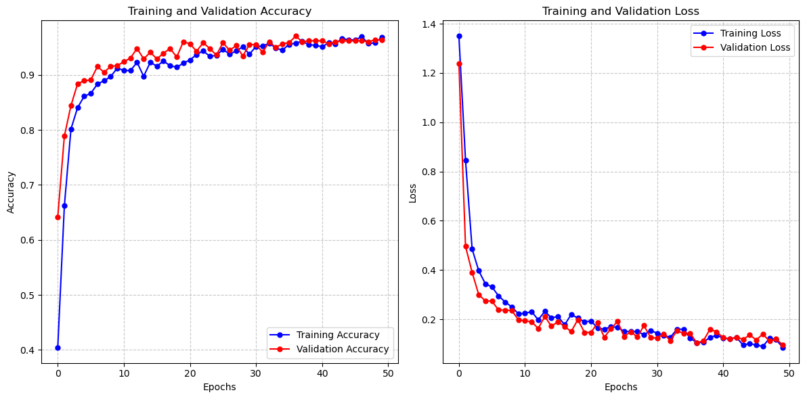
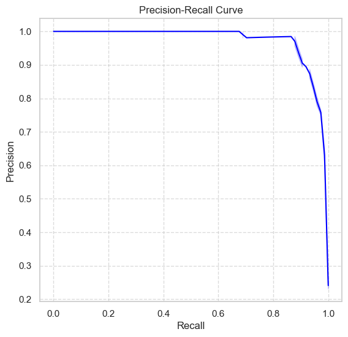
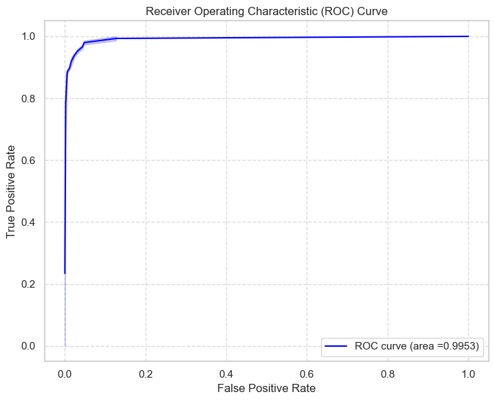

# Driver Drowsiness Detection System

## Abstract

Drowsiness in a driver is a condition that inhibits decision-making. Sleepy drivers have been involved in several accidents. In order to alert drivers before an accident, this project suggests developing a driver drowsiness detection system that uses a behavioral approach. This system has the potential to save lives and lessen traffic accidents. This research employs a trained convolutional neural network (CNN) to determine if the driver’s eyes are open or closed. Before training, the suggested model performs computer vision operations on the dataset’s images, such as edge detection, grayscale conversion, and dilation. The next step is to track face landmarks from video frames in real-time using the Google MediaPipe Face Mesh model. The proposed trained model is fed the retrieved, processed, and predicted eye area. The algorithm recognizes tiredness and alerts the driver to take precautions.

## Introduction

The National Transportation Safety Administration defines drowsy driving as a condition that accounts for approximately 2.5% of all fatalities in car accidents. In 2015 alone, there were over 72,000 crashes caused by drowsy driving. Surprisingly, car crashes caused by impaired driving outnumber those caused by drunk drivers.

Transport systems are now an essential component of human activity in everyday life. Road accidents can happen to anyone at any time for a variety of reasons, but the majority are caused by drowsiness in the driver. We are all susceptible to drowsiness while driving, whether due to a lack of sleep, a change in physical condition, or long distances. Sleep reduces the driver’s vigilance, creating dangerous situations and increasing the likelihood of an accident occurring. Drowsiness and fatigue among drivers are major causes of car accidents. They increase the number of fatalities and injuries every year. In this technologically advanced era, new technologies can play an important role in providing a solution to this problem.

This paper proposes an original method for determining whether a driver is drowsy or alert. The proposed method processes images from Kaggle’s MRL Eye Image Database. The model extracts features and uses them to train a CNN classification model. The model is tested and used to forecast drowsiness based on real-time video frames. The eye area is then extracted using the Mediapipe framework and fed into our trained CNN model. The trained CNN model removes and predicts ocular features. Finally, the system calculates the score to determine whether or not the user is sleepy. If the individual is found to be sleeping, an alarm is triggered.

## Literature Review

The creators of the Internet of Things-based Drowsy Driver Detection Smart System have combined two distinct systems, each utilizing a different methodology, into a single, reliable integrated system. In the first one, they used a behavioral strategy. Using a face landmark algorithm, facial characteristics including the lips, nose, and eyes were identified. Each area of the face’s coordinates assisted in tracing such characteristics. The system sent an emergency letter to a designated person and triggered a voice speaker to alert the driver whenever the Eye Aspect Ratio (EAR) was less than 0.25 and the number of frames was greater than 30. The second method included using vehicles, where they linked a crash sensor to an IoT module to detect collision impacts and produce data on the driver’s whereabouts. When the motorist was in an accident, the database containing this information was obtained. The information from the collision detection system was sent along with an emergency alert to the nearby clinics or a designated person. Then, the receivers took the appropriate actions to deal with the circumstance.

The authors of "IOT Based Driver Sleepiness Detection System" focused on the health-related aspects of driver drowsiness. They used an alcohol sensor to determine whether or not the driver had consumed alcohol, a temperature sensor to measure the amount of moisture and the environment inside the car, and a heartbeat sensor to monitor the heart’s rhythms. The developers of an image recognition and Internet of Things-based detection system for preventing sleepy driving. The pupils were found using OpenCV’s Hough circle, the peak or center of gravity of the data distribution was identified using the Haar Cascade method in conjunction with a mean shift, and the image border was chosen using Canny edge detection. These methods significantly improve system performance. A carbon dioxide sensor chip and voice recognition technology were also included in the system, allowing the driver to make calls or listen to music.

## Methodology

### 1. Data Ingestion

The data ingestion process is a crucial first step in developing the Driver Drowsiness Detection System. This step involves several key operations that prepare the raw data for model training and evaluation. The primary focus is on detecting and extracting relevant features from the input images, specifically focusing on the driver's facial region.

#### 1.1 Face Detection Using Cascade Classifier

The system uses the Haar Cascade Classifier, a machine learning-based approach for object detection, to detect and extract the driver's face from the input images. The classifier is trained on a set of positive images (containing faces) and negative images (without faces) to create a model that can efficiently detect faces in new images.

- **Haar Cascade Classifier**: This algorithm identifies objects in images based on the Haar-like features, which are digital image features used in object recognition. The classifier scans the image at multiple scales and positions to detect the presence of a face.

- **Process**:
  - **Loading the Cascade Classifier**: The `haarcascade_frontalface_default.xml` file, which contains the pre-trained model, is loaded using OpenCV's `CascadeClassifier` function.
  - **Face Detection**: For each image, the classifier detects faces by searching for regions that match the learned features. The detected faces are then extracted and cropped for further processing.
  - **Resizing**: The extracted face regions are resized to a fixed size (145x145 pixels) to ensure uniformity in the dataset, which is essential for consistent model training.

#### 1.2 Data Categorization

The dataset is divided into four primary categories corresponding to the different states that the model aims to recognize:
- **Yawn**
- **No Yawn**
- **Open Eyes**
- **Closed Eyes**

For each category:
- The system reads images from the respective directory.
- Applies face detection to isolate the relevant facial region.
- Resizes the detected face to the predefined dimensions.
- Labels each processed image with the appropriate category.

#### 1.3 Data Integration

Once all the images have been processed and categorized, they are combined into a single dataset. This dataset contains both the images and their corresponding labels, which will be used for training the Convolutional Neural Network (CNN).

- The dataset is then split into feature data (`X`) and labels (`y`), which are further divided into training and testing sets to ensure the model's performance can be validated on unseen data.

### 2. Data Validation

The data validation process is essential for ensuring that the dataset used for training is accurate, complete, and correctly formatted. This section describes the various checks implemented to validate the data.

#### 2.1 Validation Checks

1. **Shape Consistency Check**
   - **Purpose**: Ensures that all images have the correct dimensions.
   - **Implementation**: The `check_shape_consistency` method verifies that each image in the dataset has the dimensions `(145, 145, 3)`. Any images with inconsistent shapes will raise a `ValueError`.

2. **Label Integrity Check**
   - **Purpose**: Verifies that all labels are within the expected range.
   - **Implementation**: The `check_label_integrity` method checks that all labels are in the range `[0, 1, 2, 3]`, assuming four classes. If any labels fall outside this range, a `ValueError` is raised.

3. **Data Type Check**
   - **Purpose**: Ensures that all images are of the correct data type.
   - **Implementation**: The `check_data_types` method checks that all images are of type `np.uint8`. If any images have an incorrect data type, a `ValueError` is raised.

4. **Missing Data Check**
   - **Purpose**: Identifies any missing or `None` values in the dataset.
   - **Implementation**: The `check_missing_data` method ensures that there are no missing images or labels. If any missing data is found, a `ValueError` is raised.

5. **Class Balance Check**
   - **Purpose**: Assesses the distribution of classes in the dataset to identify any imbalance.
   - **Implementation**: The `check_class_balance` method uses the `Counter` class to tally the number of samples per class. The class distribution is printed for manual inspection to determine if any balancing is needed.

#### 2.2 Running All Checks
The `run_all_checks` method performs all the validation checks sequentially. It provides a summary of the validation process and prints the results of each check.

### 3. Data Transformation

The data transformation process prepares the dataset for training by applying normalization and augmentation techniques. This step is crucial for improving the robustness of the model and ensuring that the data is in the appropriate format for training and evaluation.

#### 3.1 Transformation Pipeline

The `DataTransformationPipeline` class uses the `ImageDataGenerator` from TensorFlow Keras to apply transformations to the training and testing data. The following transformations are applied:

1. **Normalization**:
   - **Purpose**: Scales pixel values to the range [0, 1] by dividing by 255.
   - **Implementation**: Both training and testing data are normalized to ensure consistent input to the model.

2. **Data Augmentation (for Training Data)**:
   - **Purpose**: Increases the diversity of the training data by applying random transformations.
   - **Transformations Applied**:
     - **Zoom**: Random zooms up to 20% to simulate different zoom levels.
     - **Horizontal Flip**: Random horizontal flips to account for different orientations.
     - **Rotation**: Random rotations up to 30 degrees to simulate different angles.

#### 3.2 Implementation

The `DataTransformationPipeline` class provides methods to transform the training and testing data:

- **Initialization**: Sets up `ImageDataGenerator` instances with specified transformation parameters.
  
- **`transform_train_data` Method**:
  - **Purpose**: Applies transformations to the training data.
  - **Parameters**:
    - `X_train`: Array of training images.
    - `y_train`: Array of training labels.
    - `shuffle`: Whether to shuffle the data (default is `False`).
  - **Returns**: A data generator for the training data.

- **`transform_test_data` Method**:
  - **Purpose**: Applies transformations to the testing data.
  - **Parameters**:
    - `X_test`: Array of testing images.
    - `y_test`: Array of testing labels.
    - `shuffle`: Whether to shuffle the data (default is `False`).
  - **Returns**: A data generator for the testing data.

    - `y_test`: Array of testing labels.
    - `shuffle`: Whether to shuffle the data (default is `False`).
  - **Returns**: A data generator for the testing data.

### 4. Model Building and Training

The Driver Drowsiness Detection System employs a Convolutional Neural Network (CNN) to classify images into various categories, such as "yawn," "no yawn," "open eyes," and "closed eyes." The CNN is designed to process and analyze facial images, extracting features crucial for identifying drowsiness.

**Model: Sequential**

| Layer (type)                | Output Shape              | Param #    |
|-----------------------------|----------------------------|------------|
| `conv2d` (Conv2D)           | (None, 143, 143, 256)     | 7,168      |
| `max_pooling2d` (MaxPooling2D) | (None, 71, 71, 256)       | 0          |
| `conv2d_1` (Conv2D)         | (None, 69, 69, 128)       | 295,040    |
| `max_pooling2d_1` (MaxPooling2D) | (None, 34, 34, 128)       | 0          |
| `conv2d_2` (Conv2D)         | (None, 32, 32, 64)        | 73,792     |
| `max_pooling2d_2` (MaxPooling2D) | (None, 16, 16, 64)        | 0          |
| `conv2d_3` (Conv2D)         | (None, 14, 14, 32)        | 18,464     |
| `max_pooling2d_3` (MaxPooling2D) | (None, 7, 7, 32)          | 0          |
| `flatten` (Flatten)         | (None, 1568)              | 0          |
| `dropout` (Dropout)         | (None, 1568)              | 0          |
| `dense` (Dense)             | (None, 64)                | 100,416    |
| `dense_1` (Dense)           | (None, 4)                 | 260        |

**Total params:** 495,140 (1.89 MB)  
**Trainable params:** 495,140 (1.89 MB)  
**Non-trainable params:** 0 (0.00 Byte)

### Performance Summary

The training and validation accuracy both reach approximately 96% after 50 epochs, demonstrating the model's effectiveness. The accuracy curves for both the training and validation sets follow nearly identical trajectories, which suggests that the model is generalizing well and not overfitting to the training data. Similarly, the categorical cross-entropy loss decreases sharply from over 1.2 at the start to below 0.1 by the 50th epoch, indicating that the model is learning effectively. The consistency between the training and validation loss curves further confirms that the model is well-regularized and capable of performing reliably on new, unseen data. The graph also suggests that there is potential to further reduce the loss by increasing the number of epochs, which could lead to even better performance. Overall, the model demonstrates high quality, as it strikes a balance between accuracy and generalization, without succumbing to overfitting.

### 5. Model Evaluation 
The performance of the Convolutional Neural Network (CNN) for the Driver Drowsiness Detection System was evaluated using key classification metrics: F1 Score, Precision, and Recall. These metrics provide a detailed understanding of how well the model generalizes to unseen data.
#### Key Metrics

- **F1 Score**: 0.9635
- **Precision**: 0.9636
- **Recall**: 0.9637

These results indicate that the model is highly accurate in classifying drowsy and non-drowsy states. The high F1 Score reflects a good balance between precision and recall, which is particularly important in this context where both false positives (wrongly identifying a driver as drowsy) and false negatives (failing to identify a drowsy driver) can have significant consequences.

#### High Precision and Recall
The high precision and recall scores, as reflected in the curve, suggest that the model is well-calibrated, making it very effective at classifying the data correctly without being prone to false alarms.

#### Robust Model
The precision-recall curve remains high and stable across a wide range of recall values, which implies that the model is robust and performs well even under different conditions of decision thresholding.

#### Potential Trade-offs
The slight dip in precision at very high recall values highlights the trade-off between capturing all positive instances and maintaining a low number of false positives. However, this trade-off is minimal in this model, indicating its strong performance.

The curve, which plots the True Positive Rate (TPR) against the False Positive Rate (FPR) at various threshold settings, rises sharply towards the top-left corner, indicating that the model quickly achieves a high TPR with a minimal FPR. This is further validated by the Area Under the Curve (AUC) score of 0.9953, which is remarkably close to 1. An AUC of this magnitude suggests that the model has an almost perfect ability to distinguish between positive and negative classes, reflecting a highly effective classification process.

In addition to the ROC curve, the evaluation metrics reinforce the model's strong performance. The F1 score of 0.9635, which balances precision and recall, indicates that the model is not only accurate in predicting positive instances but also consistently identifies true positives with minimal false positives. Precision and recall scores of 0.9636 and 0.9637, respectively, further highlight the model's reliability, with 96.36% of the predicted positive instances being correct and 96.37% of the actual positive instances being correctly identified. These metrics suggest that the model is highly dependable and well-calibrated, making it suitable for real-world applications where both precision and recall are critical.
